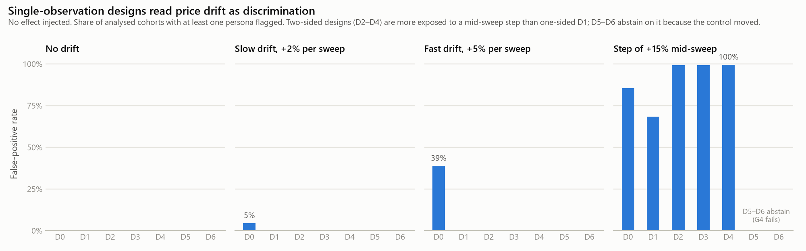
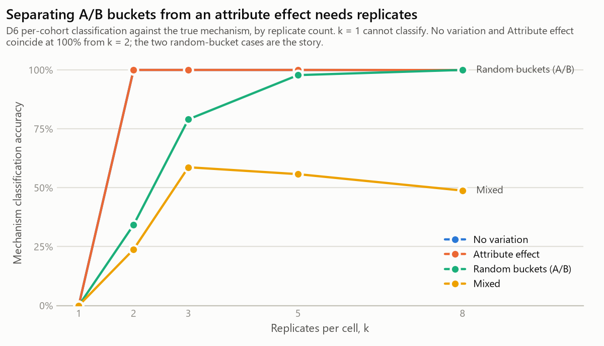
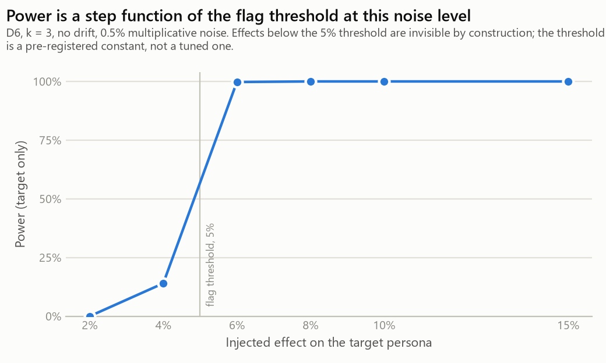
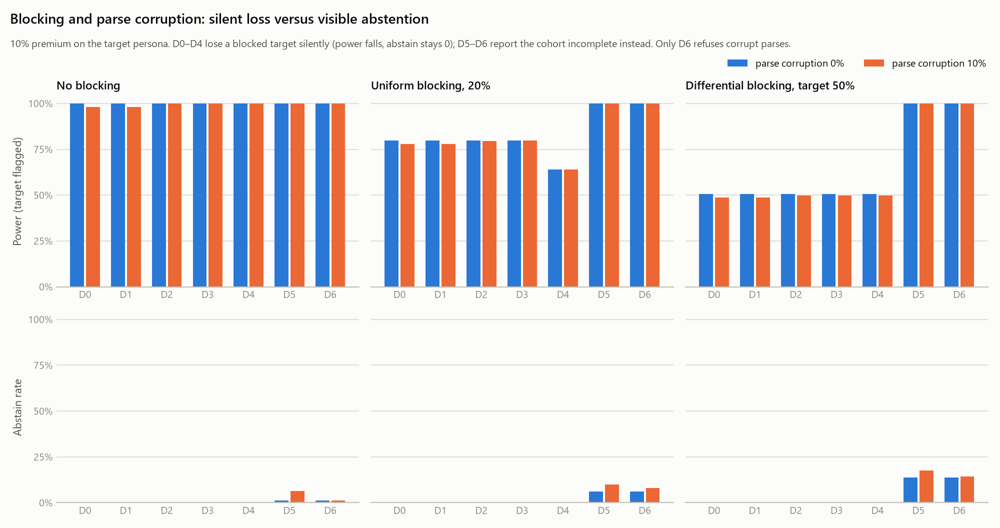

# Detector Design Determines Findings: A Simulation Study of Price Discrimination Measurement

**Eyong Defang**
September 2026 · Technical report · Repository: `price-discrimination-research`

---

## Abstract

Studies that measure online price discrimination must separate a real effect — a retailer showing different prices to different consumers — from several things that imitate one: ordinary price changes over time, randomized A/B price experiments, differential blocking of unusual visitors, and silent parsing errors. This report asks how well the detector designs used in this area actually do that. It begins from an audit of a working prototype, built by the author as a startup product, which was found to report three false positives from an ordinary $100 → $115 price change while missing a 17% targeted discount entirely. Every defect biased toward reporting a finding. The prototype was reframed as a measurement study; an instrument was built to ten stated requirements and validated against a local storefront with injected ground truth (eleven scenarios, all recovered); and a simulator generated synthetic price panels under known conditions against which a lattice of seven detector designs — from the prototype as audited (D0) to the corrected instrument (D6), one feature added per step — was run at 200 panels per condition. Pooling observations across time produced false-positive rates of 39% under fast drift and 86% under a mid-sweep step; two-sided testing, needed to see discounts, *raised* exposure to the step to 99% until a control-stability gate converted those false positives into abstentions. A single duplicated control arm — established practice in the literature — separated random A/B buckets from an attribute effect in 34% of cohorts; five replicates per cell reached 98%. Differential blocking of the target persona halved the power of every single-observation design silently, with no indication anything was missing. The findings are about measurement, not retailers: no live retail data was collected, and the report makes no claim about whether price discrimination occurs. The literature review, conducted after the design was drafted, narrowed the contribution claim and the correction is recorded as part of the result.

---

## 1. Introduction

A retailer can, in principle, vary a displayed price by anything a browser reveals: where a request appears to come from, what device made it, what language it prefers, whether the visitor has been seen before. Whether retailers *do* this — at what scale, and on which attributes — has been the subject of measurement work for over a decade [1, 2, 3, 5, 7], with results ranging from documented mechanisms on a minority of sites [3] to well-powered nulls [5] to recent evidence of behaviour-driven differential pricing in travel markets [7].

Every such study depends on an instrument: something that visits a page as several constructed consumers, records the prices shown, and decides whether the differences mean anything. This report is about that instrument, and specifically about a question the prevalence literature tends to take as settled: **how often does a detector of this kind report price discrimination that is not there, and what design features determine the rate?**

The question is not abstract. The author built such a detector as the first component of a consumer startup, audited it, and found that it would have produced confident findings from ordinary price movements. That prototype is the starting point of this report and the D0 design in its results.

### 1.1 Contributions

1. **An audit of a working prototype**, with each defect verified by execution rather than asserted, and a demonstration that every defect biased in the same direction (§4).
2. **A measurement instrument** built to ten stated requirements, each traceable to an audited defect, and **validated against ground truth** in eleven storefront scenarios including the requirement to report nothing where nothing was injected (§6, §7).
3. **A simulation study** characterizing false-positive rate, power, misattribution, and abstention for a seven-step design lattice under temporal drift, A/B testing, blocking, and parse corruption (§8).
4. **A replication-count result** for separating random price buckets from attribute-based pricing: a single duplicated control (k = 2) achieves 34% per-cohort accuracy; k = 5 reaches 98% (§8.2).
5. **A documented narrowing of the contribution claim** after the literature review found duplicated control accounts to be established practice — presented as part of the research record rather than edited out (§5.3, §9).

### 1.2 What this report does not claim

No live retailer was measured. No prevalence or magnitude estimate for real markets is offered. Simulation results depend on whether the generating processes resemble reality, and that assumption is stated rather than proven (§10).

---

## 2. Background: price discrimination and its measurement

*Price discrimination*, in the economic sense, is charging different prices to different buyers for the same good where the difference is not explained by cost. The 2015 Council of Economic Advisers report [6] surveys the practice under the name *differential pricing*, notes that it often benefits both firms and consumers, and identifies the concern as arising when consumers are unaware of how their information is used or when pricing keys on factors outside their control.

Online, the practice is entangled with *personalization* more broadly. Hannak et al. [3] distinguish **price discrimination** (customizing the price of a product) from **price steering** (customizing which products, or which order, a user sees). Both can be measured with the same method: construct controlled browser profiles, issue matched requests, compare what comes back, and subtract measurement noise [2].

The measurement problem is that price differences have many causes other than the visitor. Hannak et al. list inventory changes, regional tax, and inconsistency across data centres [3]; Vissers et al. attributed the fluctuations they observed in airline pricing to regional tax and similar factors and found no systematic discrimination across 25 airlines [5]. Chen, Mislove and Wilson documented algorithmic repricing by over 500 sellers on Amazon Marketplace [4], establishing that prices move quickly for reasons unrelated to who is looking. Any instrument that ignores these produces findings. The question this report asks is how many.

---

## 3. The consumer's problem

A consumer shopping online sees one price and has no way to know what anyone else was shown. Karan, Balepur and Sundaram [7] name this directly: in many online markets "we shop alone." The opacity is the condition under which differential pricing can operate undetected, and it is also the condition that makes measurement necessary — there is no natural comparison available to an individual.

The practical consequence for a measurement study is that the *unit of comparison* must be constructed. Two prices are comparable only if they are for the same good, at the same moment, from the same seller, and differ only in the buyer's attributes. Karan et al. call the last condition *consensus*: the auditor must be able to show that the seller actually received the attributes the auditor claims to have sent [7]. A measurement where the seller saw a bot rather than the persona has no consensus and no interpretation. Section 6 returns to this.

---

## 4. Origin and motivation

### 4.1 The startup prototype

The work began in June 2026 as the cold-start engine for a consumer savings product. A Playwright scraper visited product pages under three browser personas — varying locale, timezone, geolocation, and device — recorded the displayed price in SQLite, and flagged any persona whose price exceeded the cohort median by more than 5%. The intent was to prove detection logic before recruiting real users.

The prototype was never run successfully. Its configured target was `example.com`, no data directory was ever created, and none of its logic was ever exercised against a known answer.

### 4.2 The audit

An audit conducted in September 2026 read the code, then verified each suspected defect by executing the prototype's own logic on constructed inputs. Four defects were confirmed at the design level and four more in the parsing and data layers. The design defects:

| Defect | Behaviour | Verified outcome |
|---|---|---|
| **A1** Cross-time pooling | Grouped by product only; every observation ever recorded entered one median | A $100 → $115 retailer price change between runs, with no persona treated differently, flagged all three personas at +6.98% |
| **A2** One-sided test | Flagged only prices *above* the median | A persona shown a 17% targeted discount was not flagged |
| **A3** Self-inclusive baseline | The median included the observation under test | With three personas at most one could ever flag; the middle one never could |
| **A4** Confounded personas | Each persona varied four attributes at once | No effect attributable to any single attribute |

And in the data layers: the price parser read `$1,299.00` as 129.0 and `$24,999.00` as 2499.0 without error (seven of nine common formats wrong); currency was parsed, stored, and never used in analysis; and the analysis query filtered `WHERE price IS NOT NULL`, so a persona that was blocked by anti-bot measures — the unusual persona, the one most likely to be treated differently — vanished from the cohort silently and the output read as a clean null.

### 4.3 The pattern, and the reframe

The audit's most useful finding was not any single defect but their common direction. Flag only high prices; pool across time so drift becomes signal; drop the observations that would complicate the picture; choose a threshold that makes the output look reasonable. None of this was dishonest. It is what building a detector *whose purpose is to detect* does to a measurement layer, because a product that finds nothing has no reason to exist.

That observation motivated the reframe from product to study. Under a research frame a rigorous null is a result, which inverts the incentive from sensitivity to validity. The full argument is in the repository's `docs/00-from-startup-to-research.md`; a feasibility assessment (`docs/09-feasibility-assessment.md`) then established that every component of a field study except live retail targets was achievable at zero cost, and scoped the work to what could be finished.

---

## 5. Related work

Citations were verified after the design was drafted; the verification level for each is recorded in the repository (`docs/08-literature.md`). This section reports what was found and what it changed.

### 5.1 Measuring price discrimination

Mikians et al. [1] reported early signs of both price and search discrimination and proposed a distributed watchdog; a crowd-assisted follow-up identified sites personalizing mostly on geolocation. Hannak et al. [3] studied 16 e-commerce sites with the accounts and cookies of 300 real users plus synthetic accounts, found some form of personalization on nine, attributed it to specific features on seven, and released their crawling scripts and data. Vissers et al. [5] ran 66 profiles from two locations against 25 airlines for three weeks (over 130,000 queries) and found no systematic discrimination. Karan et al. [7] audited kayak.com flight and hotel markets with nine behaviour-based profiles over 58 days, fit a structural causal model by Bayesian inference, and found that some profiles were nearly 90% more likely to see a worse price than the best-performing profile.

### 5.2 Methodology

The controlled-profile, matched-query, noise-subtraction method originates in Hannak et al.'s web-search personalization work [2]. Its e-commerce application [3] adds a specific device for noise: *duplicated control accounts*. In the authors' words, they "include a control in each experiment that is configured identically to one other treatment (i.e., we run one of the experimental treatments twice)." The inconsistency between the control and its twin is the noise floor; inconsistency between treatments above that floor is attributed to personalization. The same paper identifies A/B testing as a mechanism observed in the field: "Expedia and Hotels.com engage in A/B testing that steers a subset of users towards more expensive hotels."

Karan et al. [7] quantify a chance baseline directly — a price difference by chance of $0.44 in flights and $0.09 in hotels — and compare observed profile differences of up to $6.00 and $3.00 against it.

### 5.3 What the review changed

The proposal for this study was drafted before the review and claimed, as a contribution, the first test of whether replicated observation can separate attribute-based pricing from randomized A/B assignment. The review established that replication for noise control is established practice [3] and that a chance baseline has been quantified [7]. The claim was narrowed to what neither work characterizes: *how much* replication the separation needs, and whether a single duplicated arm — Hannak's twin, k = 2 on one treatment — performs as well as replicating every cell. Those are statistical properties of a design, which simulation is suited to answer.

The proposal also described the evidence base as "thin and aging." That was wrong for travel markets, where [7] is recent and causally modeled; it holds for fixed-SKU general retail, which has not been broadly re-measured since [3]. Both corrections are recorded in the repository with the original wording struck through rather than replaced.

---

## 6. System design and methodology

### 6.1 Design principles from the audit

Each audited defect maps to a requirement on the instrument (repository `docs/03-measurement-protocol.md`, R1–R10) and to a threat in a tiered register (`docs/05-threats-to-validity.md`, T1–T15). The principles that carry the most weight:

**The sweep is the unit of comparison (R1).** A sweep is all products × all personas × all replicates collected within a bounded window. No price is ever compared to a price from a different sweep. Cross-sweep variation is temporal drift and is measured separately, via the control persona.

**A control persona sits at every factor's control level and appears in every sweep (design §2).** It is the reference against which effects are measured and the meter that reads drift. Its replicates are placed at evenly spaced positions across the sweep's randomized visit order — not shuffled in with the rest — because the control-stability gate (G4) asks whether the control's price moved *during* the sweep and can only answer if the control was sampled throughout. This is a strengthening of the duplicated-control idea in [3]: the same primitive, used to detect within-window drift rather than only to floor the noise.

**Detection is two-sided (R2), the reference excludes the observation under test (R3), and currency is a grouping key (R4).** A persona shown a *lower* price is a finding.

**An incomplete cohort is a distinct outcome, not a filter (R5).** A cohort with a missing persona is reported as incomplete and does not enter the panel. This is the correction for the silent-selection defect.

**Every page load is classified by a structural canary before its price is trusted (R6).** Challenge pages are routinely served with HTTP 200, so the check reads markup, not status. Without it, "all personas were blocked" and "no persona was treated differently" produce the same rows. This is the operational form of Karan et al.'s consensus condition [7].

**The parser resolves separators by locale, never by inspecting the string; returns every candidate on the page; and produces a status rather than a number on any ambiguity (R7).** `1,299` is 1299 under en-US and ambiguous under de-DE, and no amount of looking at the text settles it. A parser that guesses is the defect that produced 129.0.

### 6.2 Persona design

Personas are points on a factor grid — geography, device, locale, timezone, visit history — with a designated control level per factor. The one-factor-at-a-time set (control plus one persona per non-control level) identifies every main effect with the fewest personas; it cannot see interactions, and the validation includes an interaction scenario precisely to confirm the instrument reports *nothing* there rather than something spurious. Because the experimenter assigns personas at random, the main effect is identified by randomization; observational causal-inference machinery, which the original roadmap had planned to use, addresses a selection problem this design does not have.

### 6.3 The detector lattice

To attribute error rates to design features, seven designs were defined so that each differs from its predecessor by one feature:

| Design | Within-sweep | Two-sided | Leave-one-out | Control arm | Replicates + G4 | Robust parser |
|---|---|---|---|---|---|---|
| **D0** — prototype as audited | — | — | — | — | — | — |
| D1 | ✓ | — | — | — | — | — |
| D2 | ✓ | ✓ | — | — | — | — |
| D3 | ✓ | ✓ | ✓ | — | — | — |
| D4 | ✓ | ✓ | ✓ | ✓ | — | — |
| D5 | ✓ | ✓ | ✓ | ✓ | ✓ | — |
| **D6** — corrected instrument | ✓ | ✓ | ✓ | ✓ | ✓ | ✓ |

Two ordering decisions were made during implementation. Leave-one-out precedes the control arm because once a control is the reference the leave-one-out step is vacuous and its contribution could not be measured. The parser is a separate final step because parse quality is orthogonal to statistical design; folding it into D5 would have confounded two effects. "Replicates + G4" bundles three things that only exist together: more than one observation per cell, the control-stability gate that needs them, and the rule that an incomplete cohort abstains. D0–D4 observe each cell once and drop failures silently, as the prototype did.

---

## 7. Data collection and analysis methods

### 7.1 Validation against known ground truth

Simulation establishes statistical properties; it does not establish that software works. The instrument was therefore validated end to end — sweep planning, fetching, canary, extraction, storage, QC gates, cohort evaluation, mechanism classification — against a local mock storefront that prices products as a *known* function of the request's persona signals. Eleven scenarios inject one condition each:

| Scenario | Injected | Correct report |
|---|---|---|
| `none` | nothing | nothing |
| `device_premium` | mobile +12% | mobile flagged, premium |
| `geo_premium` | one region +10% | that region flagged, premium |
| `hist_premium` | returning visitor +8% | primed persona flagged, premium |
| `targeted_discount` | mobile −15% | mobile flagged, **discount** |
| `interaction` | mobile × one region +15% | nothing (invisible to one-factor-at-a-time; correctly so) |
| `locale_currency` | de-DE quoted in EUR | separate EUR cohort, never compared |
| `strikethrough` | list price struck through beside sale price | nothing; sale price taken, not the first match |
| `mid_sweep_step` | +15% after the midpoint of the sweep | **G4 fails**; the step is not read as discrimination |
| `bot_page` | mobile served a challenge page with HTTP 200 | cohort incomplete; G1 and G2 fail |
| `ab_test` | price alternates between buckets per request | G4 fails; mechanism classified as replicate-random |

The check is symmetric: a scenario with no effect must produce no finding, asserted as hard as an effect must produce one. All eleven are recovered over plain HTTP (43.8 s) and the device-premium scenario is additionally recovered over a real Chromium browser with a fresh context per visit (7.1 s).

### 7.2 Simulation design

A generator produces panels of shape (sweeps, products, personas, replicates) — 5 × 20 × 7 × k — with base prices log-uniform on [$10, $3,000] so that roughly a fifth exceed $1,000, the range in which the prototype's parser failed. Conditions cross:

- **Effect:** none / +10% premium / −10% discount on the target persona (`dev=mobile`)
- **Drift:** none / +2% per sweep / +5% per sweep / +15% step at the midpoint of each sweep's visit order
- **A/B testing:** off / on, each observation independently in a +10% bucket with probability ½
- **Blocking:** none / uniform 20% / differential 50% on the target persona only
- **Parse corruption:** 0 / 10%, modelling the prototype parser — a price ≥ $1,000 read at one tenth
- **Noise:** 0.5% multiplicative, always on

Four grids address the research questions: **A** (effect × drift, all designs), **B** (effect × A/B × k ∈ {1, 2, 3, 5, 8}, replicate designs), **C** (effect × blocking × corruption, all designs), **D** (effect size ∈ {2, 4, 6, 8, 10, 15}%, D6). Each condition runs 200 Monte Carlo panels from a recorded seed; every reported number is reproducible from `results/ablation_rows.csv`.

### 7.3 Outcomes

Per cohort (product, sweep), each design yields one of: *abstain* (excluded by QC — replicate designs only), *target only*, *non-target involved*, or *nothing*. Over the cohorts of a condition: **false-positive rate** (any flag, no effect present), **power** (target flagged, effect present; strict variant requires no non-target), **misattribution** (non-target flagged, effect present), and **abstain rate**. For replicate designs, a **mechanism classification** — none / attribute-correlated / replicate-random / mixed — from the within-cell versus between-cell variance decomposition, scored against the true generating mechanism.

Rates are over analysed cohorts; abstain is over all cohorts. The flag threshold is 5% throughout — the prototype's value, retained so that D0 is the prototype — and is a pre-registered constant, not a tuned one.

### 7.4 Consistency between the fast path and the real one

The lattice is implemented in vectorized NumPy for Monte Carlo speed. A test constructs `Observation` records from a simulated panel, runs the production detector on each cohort, and asserts that it flags the same personas as the vectorized D6 — so the simulation cannot quietly diverge from the code that would analyse real data.

### 7.5 Tools and technologies

Everything is Python 3.12 and free software. The dependency list is deliberately short:
a study whose point is that instruments should be checkable is poorly served by a stack
nobody can reproduce.

| Tool | Version | Used for |
|---|---|---|
| **Python** | 3.12 | Everything |
| **Playwright** | 1.44+ | Real-browser collection: one Chromium process, a fresh context per observation, explicit waits for the price element |
| **SQLite** | stdlib `sqlite3` | The observation panel; CHECK constraints enforce two of the audit's invariants at the storage layer |
| **NumPy** | 2.5 | Vectorized simulation — the D0–D6 lattice over (sweeps x products x personas x replicates) arrays |
| **pandas** | 3.0 | Aggregating Monte Carlo rows into per-condition means and confidence intervals |
| **SciPy** | 1.18 | One-way ANOVA in the mechanism classifier |
| **matplotlib** | 3.11 | Figures 1–4 |
| **pytest** | 9.1 | 156 tests, including the audit's failures as regression tests |
| **Git / GitHub Actions** | — | Version control; CI on Python 3.11 and 3.12 plus a separate real-browser job |
| Python stdlib | 3.12 | `http.server` (mock storefront), `html.parser` (price-node extraction), `urllib` + `http.cookiejar` (HTTP fetcher and visit history), `dataclasses`, `enum`, `statistics`, `unicodedata` |
| **reportlab** | 5.0 | Typesetting this report |
| **python-pptx** | 1.0 | The accompanying slide deck |

No paid service, no proxy provider, no cloud infrastructure, and no LLM-based component
is used anywhere in the instrument or the analysis. Total cost of the study: zero.

---

---

## 8. Results

### 8.1 False positives under temporal drift (Grid A; Figure 1)



With no effect injected:

| Drift | D0 | D1 | D2 | D3 | D4 | D5 | D6 |
|---|---|---|---|---|---|---|---|
| none | 0.0% | 0.0% | 0.0% | 0.0% | 0.0% | 0.0% | 0.0% |
| +2% / sweep | **4.5%** | 0.0% | 0.0% | 0.0% | 0.0% | 0.0% | 0.0% |
| +5% / sweep | **38.9%** | 0.0% | 0.0% | 0.0% | 0.0% | 0.0% | 0.0% |
| +15% step mid-sweep | **85.5%** | **68.4%** | **99.2%** | **99.2%** | **99.6%** | abstain 100% | abstain 100% |

Three things are visible. First, **cross-time pooling alone (D0) manufactures findings from ordinary drift**, at a rate that scales with the drift: 39% of cohorts under +5% per sweep. Within-sweep comparison (D1 onward) eliminates this entirely, as the audit predicted.

Second, **within-sweep drift defeats every single-observation design**, and **two-sided testing makes it worse**: D1's one-sided test flags 68% of stepped cohorts (only the post-step observations exceed the median); D2–D4 flag 99% (both sides now register). Two-sided testing is required to see discounts (§8.3) and it raises exposure to drift. The two are only reconciled by the control-stability gate.

Third, **G4 converts those false positives into abstentions**. D5 and D6 analyse no stepped cohort — the control, sampled at the first and last positions of every sweep, always straddles the step. The cost of the gate is visible in the clean conditions: 1.2% of cohorts abstain under no drift, from 0.5% noise occasionally moving control replicates more than the 2% tolerance. That is the false-abstention rate of G4 at these settings, and it is a number a field study would need to budget for.

### 8.2 Mechanism separation by replicate count (Grid B; Figure 2)



Per-cohort classification accuracy for D6 against the true mechanism:

| True mechanism | k = 1 | k = 2 | k = 3 | k = 5 | k = 8 |
|---|---|---|---|---|---|
| none | — | 100% | 100% | 100% | 100% |
| attribute effect | — | 100% | 100% | 100% | 99.9% |
| random buckets (A/B) | — | **34.2%** | **79.0%** | **97.8%** | 100% |
| mixed | — | 23.8% | 58.7% | 55.8% | 48.8% |

This is the result the narrowed RQ3 asked for. **A single duplicated observation — k = 2, the twin-control structure of [3] applied to every cell — identifies random bucketing correctly in about a third of cohorts.** With two draws from a fair two-bucket assignment the replicates agree half the time, so half the cells look stable, and the classifier's majority rule does not fire. Three replicates reach 79%; five reach 98%. The stable mechanisms (none, attribute) are classified perfectly from k = 2 because agreement is what they predict.

The **mixed** case — an attribute effect *and* random bucketing at once — plateaus near 50% and does not improve with k. The classification rule requires the between-persona variance to exceed the within-cell variance before crediting an attribute effect on top of randomness; under equal-sized effects (10% each) it does not reliably. This is a limitation of the rule as written, and a real one: bucket assignment that itself correlates with attributes is exactly the case a field study would most want to detect (§10).

### 8.3 Power and direction (Grid A, D)

At a 10% effect with no drift, every design reaches 100% strict power for a **premium** — including D3, whose leave-one-out median is robust with seven personas and a single shifted one. The misattribution pathology observed in the audit (all personas flagged) requires a small cohort or a majority shift, not leave-one-out as such. For a **discount**, D0 and D1 have 0% power by construction; D2 onward, 100%.

Power for D6 by effect size (Grid D; Figure 4): 0% at 2%, 14% at 4%, 99.8% at 6%, 100% from 8%. At 0.5% noise, power is a step at the flag threshold. The 4% row shows noise occasionally lifting a 4% effect over the 5% line; a field study's minimum detectable effect is a function of its real noise and would be set from a pilot, not inherited.



### 8.4 Blocking and parse corruption (Grid C; Figure 3)



With a 10% premium on the target persona:

| Blocking | D0–D3 power | D4 power | D5–D6 power | D5–D6 abstain |
|---|---|---|---|---|
| none | 100% | 100% | 100% | 1.2% |
| uniform 20% | 79.9% | **64.0%** | 100% | 6.1% |
| differential 50% (target) | **50.7%** | **50.7%** | 100% | 13.7% |

**Differential blocking halves the power of every single-observation design, silently.** The blocked target is simply absent, the cohort looks complete, and the abstain rate stays at zero — there is no indication in the output that anything is missing. This is the selection-bias mechanism the audit identified in the `WHERE price IS NOT NULL` filter, measured. D4 is additionally hurt by uniform blocking because a blocked *control* leaves it with no reference. D5 and D6 lose no power: replicates recover the cell unless all k are blocked, and when they are, the cohort abstains visibly (13.7% ≈ 0.5³ + noise).

Parse corruption at 10% (a price ≥ $1,000 read at one tenth) produces false positives in every two-sided design without a refusing parser — 8.6% (D2, D3), 9.6% (D4), 12.3% (D5) — and 0.0% in D6, which records the corrupted observation as ambiguous rather than as a number. D5 is the most exposed because three replicates give three chances at corruption. One-sided designs are accidentally protected (0.0–0.1%): the corrupted observation is *low*, so it never exceeds the median. The same asymmetry that hides discounts hides this defect.

A property established in testing and worth stating: a parser defect that hits every observation the same way is undetectable by *any* within-cohort design, because ratios survive. Only partial corruption bites, and only a parser that refuses can prevent it.

---

## 9. Challenges, obstacles, and what changed along the way

This section records what went wrong or had to change, because a report that shows only the final design misrepresents how it was reached.

**The prototype was the obstacle.** The first weeks of the project were spent believing a detector existed. It existed as code and had never produced a number. The audit's method — executing the logic on constructed inputs with known answers — is what turned suspicion into a table, and it is the method the rest of the project adopted.

**The feasibility assessment removed the field study.** The design documents describe a factorial field experiment with proxy-based geography, a pilot, a power analysis, and pre-registration. Costing each component showed every blocker concentrated in one place — live commercial retailers — with legal exposure landing on one uninsured individual and anti-bot systems likely to win regardless. Everything else was free. The study was rebuilt around the reachable question, and the field design retained as a reference for revival. That was a loss of the original aim and is recorded as one.

**The literature review narrowed the contribution.** Verification of citations, done after the proposal was drafted, found that the review's highest-priority question — whether prior work had already used replication to separate A/B testing from discrimination — resolved against the claim. The claim was narrowed (§5.3). The right order would have been to verify first; the order actually followed is reported.

**The vectorized simulator disagreed with the tests, and the tests were wrong.** Three simulator tests failed on first run. Each encoded an expectation from the audit's small hand-built scenarios that did not hold at the simulation's scale: leave-one-out is robust at seven personas (§8.3); D0's false-positive rate under +5% drift sits on a threshold knife-edge that integer rounding decides; and uniform parse corruption is invisible because ratios survive. The code was right and the expectations were corrected — with the reasoning left in the tests.

**G4 as "identical" is too strict.** The protocol specifies that the control's price be *identical* across replicates. Under any measurement noise it is not, and a literal implementation would abstain on every cohort. The simulator uses a 2% tolerance, which produces the 1.2% false-abstention rate in §8.1. A field study would need to pre-register that tolerance, and the protocol document should say so.

**The mock storefront had to make randomness deterministic.** The A/B scenario originally drew buckets from a random generator, which made the validation's outcome a matter of chance on any given seed. The store now alternates buckets per request, and the sweep runner's seeded visit order makes the whole validation reproducible.

**The parser had to parse under the page's locale, not the persona's.** A de-DE persona served a US page must read `$99.00` as USD under en-US rules, not reject it as ambiguous under de-DE rules. The persona's locale is what the request *asked for*; the page's declared `lang` is what the page *is written in*, and a retailer is free to ignore the request. This was found during validation, not design.

---

## 10. Limitations

**Simulation realism is the central limitation.** The error rates in §8 hold for the generating processes described in §7.2. If real retail prices move in ways not modelled — more complex drift, correlated noise across personas, bot detection that degrades rather than blocks — the rates will not transfer. The parameters were chosen to be plausible and are reported as such, not as estimates of anything.

**The mixed-mechanism classifier is weak** (§8.2). Its plateau near 50% means the design cannot currently distinguish "A/B testing" from "A/B testing whose bucket assignment correlates with attributes." A likelihood-based classifier, or a formal test on the variance ratio, would likely do better and was not attempted.

**The lattice covers designs reachable from the prototype**, not every design in the literature. In particular it does not implement the information-retrieval metrics of [3] for steering, or the structural causal model of [7].

**Mock-storefront validation proves the instrument works against a cooperative target.** It says nothing about defended ones. The canary is structural and would need per-retailer rules; selector drift is unaddressed.

**Seven personas, one target.** The simulation injects an effect on one persona. Multi-persona effects, and cohorts smaller than seven, were not simulated, and §8.3 notes that the leave-one-out result depends on cohort size.

**No claim about retailers.** Restated because it is the one most likely to be misread.

---

## 11. Lessons learned

1. **Check the instrument against a known answer before trusting anything it says about an unknown one.** The prototype's entire failure reduces to skipping this step.
2. **A detector's incentives shape its errors.** Every audited defect biased toward findings, not because of carelessness but because a detector that finds nothing is useless as a product. Reframing as research inverted the incentive and made the null result worth reporting.
3. **Replication is not one thing.** A duplicated control floors the noise; replicating every cell classifies the mechanism; and the number of replicates determines whether the classification is reliable. These are different uses of the same primitive and the literature does not always distinguish them.
4. **Two-sided testing has a cost.** It is necessary to see discounts and it doubles exposure to drift. The control-stability gate is not optional once the test is two-sided.
5. **Silent loss is worse than visible abstention.** A design that reports 50% power with no indication anything is missing is more dangerous than one that abstains on 14% of cohorts and says so.
6. **Verify citations before making claims from them.** The order followed here cost a contribution claim. It would have cost more had the review been skipped.
7. **Write down what was wrong.** Every corrected expectation, narrowed claim, and struck-through sentence in this project's documents is more useful to the next reader than the clean version would have been.

---

## 12. Future work

**Field study.** The instrument, the validation harness, and the design documents exist for the purpose of reviving the field study if affiliation or funding appear. Phase 2 of the lifecycle (a pilot against one or two permission-based targets to estimate within-cell variance and the feasible sweep window) is the next step, and its ethics gate — including the proxy-sourcing problem documented in the repository — is unchanged.

**Better mechanism classification.** A likelihood-ratio or Bayesian classifier over the variance decomposition, evaluated on the same Grid B, would address the mixed-case weakness.

**Richer generating processes.** Correlated noise, multi-target effects, degraded rather than blocked pages, and empirically grounded drift parameters from a pilot.

**Twin-versus-cell replication, formally.** Grid B replicates every cell. A direct comparison with a single duplicated arm at equal request budget — the design of [3] — would settle whether full-cell replication is worth its cost.

**Applications.** The instrument is a general audit tool for any displayed-price system where the auditor controls the visitor's attributes: consumer-protection agencies, journalists, or retailers auditing their own personalization for unintended effects. The consumer product it began as is not among these; that thesis was tested by customer discovery and did not survive, and this report does not resurrect it.

---

## 13. Conclusion

A price-discrimination detector built to detect will detect. This report measured how much. Pooling observations across time produced findings from ordinary price movements at rates up to 86%; adding the two-sided test needed to see discounts raised exposure to within-window drift to 99%; a control-stability gate converted those findings into abstentions at a cost of 1.2% false abstention. A single duplicated control separated random buckets from an attribute effect a third of the time; five replicates per cell, 98% of the time. Differential blocking silently halved the power of every design that observes each cell once. A parser that guessed produced false positives in every two-sided design; one that refused produced none.

None of this says anything about retailers. It says what a measurement of them can and cannot support, and it does so with the instrument's own errors — and the study's own corrections — in the record rather than out of it.

---

## References

[1] J. Mikians, L. Gyarmati, V. Erramilli, and N. Laoutaris. Detecting price and search discrimination on the Internet. *Proc. 11th ACM Workshop on Hot Topics in Networks (HotNets-XI)*, Seattle, October 2012. doi:10.1145/2390231.2390245.

[2] A. Hannak, P. Sapiezynski, A. Molavi Kakhki, B. Krishnamurthy, D. Lazer, A. Mislove, and C. Wilson. Measuring personalization of web search. *Proc. 22nd International Conference on World Wide Web (WWW 2013)*, pp. 527–538. doi:10.1145/2488388.2488435.

[3] A. Hannak, G. Soeller, D. Lazer, A. Mislove, and C. Wilson. Measuring price discrimination and steering on e-commerce web sites. *Proc. 2014 Internet Measurement Conference (IMC 2014)*, pp. 305–318. doi:10.1145/2663716.2663744.

[4] L. Chen, A. Mislove, and C. Wilson. An empirical analysis of algorithmic pricing on Amazon Marketplace. *Proc. 25th International Conference on World Wide Web (WWW 2016)*, Montréal, pp. 1339–1349. doi:10.1145/2872427.2883089.

[5] T. Vissers, N. Nikiforakis, N. Bielova, and W. Joosen. Crying wolf? On the price discrimination of online airline tickets. *7th Workshop on Hot Topics in Privacy Enhancing Technologies (HotPETs 2014)*, Amsterdam, July 2014.

[6] Council of Economic Advisers. *Big Data and Differential Pricing*. Executive Office of the President, February 2015.

[7] A. Karan, N. Balepur, and H. Sundaram. Your browsing history may cost you: A framework for discovering differential pricing in non-transparent markets. *Proc. 2023 ACM Conference on Fairness, Accountability, and Transparency (FAccT 2023)*, Chicago, June 2023. doi:10.1145/3593013.3594038.

---

## Appendix A. Reproducing every number

```
python -m pip install -e ".[dev,sim]"
python -m pytest -q -m "not slow"        # unit, integration, and mock end-to-end tests
python scripts/validate_mock.py          # the eleven-scenario table in section 7.1
python scripts/compare_v0.py             # the audit scenarios, v0 against corrected
python scripts/run_ablation.py           # grids A-D, 200 panels each, seed 20260919 (~80 s)
python scripts/make_figures.py           # figures 1-4 from results/ablation_summary.csv
```

Every rate in section 8 is a mean over rows of `results/ablation_rows.csv` (regenerated by `run_ablation.py`; not committed at 6 MB) grouped as in the committed `results/ablation_summary.csv`, which also carries 95% confidence half-widths.

## Appendix B. The audit scenarios

The four scenarios from the prototype audit, as run against both the prototype's logic and the corrected instrument (`scripts/compare_v0.py`):

| Scenario | Ground truth | Prototype (D0) | Corrected (D6) |
|---|---|---|---|
| Price rises $100 → $115 between sweeps | nothing | three personas at +6.98% | nothing |
| Mobile shown a 17% discount | flag mobile, discount | nothing | mobile −16.67%, discount |
| Two personas high, one at true price (N = 3) | flag the outlier | nothing | flagged (all three, without a control) |
| Mobile blocked by anti-bot | report incomplete | "nothing flagged" | incomplete: mobile (canary: bot_page) |
| Same 17% discount with a control persona | flag mobile only | nothing | mobile −16.67% vs control |
