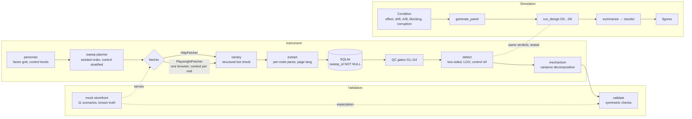

# Price Discrimination Measurement Study

**Detector design determines findings.** A measurement instrument for online price
discrimination, validated against known ground truth, and a simulation study showing
how often the detector designs used in this area report discrimination that is not
there — including the one this project started with.

[](https://github.com/edefang/price-discrimination-research/actions/workflows/ci.yml)
[](LICENSE)

> **Read this first.** No live retailer was measured. This repository makes no claim
> about whether price discrimination occurs. It is a study of *measurement*: what an
> instrument of this kind can and cannot support. The full write-up is
> [`PAPER.md`](PAPER.md).

---

## Contents

- [Overview](#overview)
- [The problem](#the-problem)
- [Where this came from](#where-this-came-from)
- [What is here](#what-is-here)
- [Headline results](#headline-results)
- [Architecture](#architecture)
- [Installation](#installation)
- [Usage](#usage)
- [API](#api)
- [Repository layout](#repository-layout)
- [Project lifecycle](#project-lifecycle)
- [Future work](#future-work)
- [Contributing and license](#contributing-and-license)

---

## Overview

Studies that measure online price discrimination visit product pages as several
constructed consumers, record the prices shown, and decide whether the differences mean
anything. That last step has to separate a real effect from at least four things that
imitate one: **ordinary price changes over time**, **randomized A/B price experiments**,
**differential blocking** of unusual visitors, and **silent parsing errors**.

This project asks how well the detector designs used in this area actually do that. It
contains:

1. **An audited prototype** — a working detector built by the author as a startup
   product, found on inspection to report three false positives from an ordinary
   $100 → $115 price change and to miss a 17% targeted discount entirely.
2. **A corrected instrument** built to ten stated requirements, each traceable to an
   audited defect, and **validated end to end against a mock storefront** whose prices
   are a known function of the visitor — eleven scenarios, all recovered, including the
   requirement to report *nothing* where nothing was injected.
3. **A simulation study** running a seven-step lattice of detector designs — from the
   prototype as audited (D0) to the corrected instrument (D6), one feature per step —
   against synthetic panels with known ground truth, at 200 Monte Carlo panels per
   condition.
4. **Design documents** for the field study this would become with affiliation and
   funding, plus the feasibility assessment explaining why it is not being run now.

## The problem

A consumer shopping online sees one price and cannot know what anyone else was shown.
The opacity is what lets differential pricing operate undetected, and it is what makes
measurement necessary: there is no natural comparison available to an individual, so
the comparison has to be constructed.

Constructing it correctly is the whole difficulty. Two prices are comparable only if
they are for the same good, at the same moment, from the same seller, and differ only
in the buyer's attributes. Every one of those conditions can fail quietly, and a
detector that does not check them will report the failure as a finding.

## Where this came from

This began in June 2026 as the cold-start engine for a consumer savings product: a
Playwright scraper varying browser personas and flagging price gaps above 5% of the
cohort median. An audit in September 2026 executed its logic on constructed inputs and
found every defect biased the same way — toward reporting a finding. Prices were pooled
across time, so drift became signal; the test was one-sided, so discounts were
invisible; blocked personas were filtered out silently; and `$1,299.00` parsed as
`129.0` without error.

None of that was dishonest. It is what building a detector *whose purpose is to detect*
does to a measurement layer, because a product that finds nothing has no reason to
exist. Under a research frame a rigorous null is a result, which inverts the incentive.
The reframe is argued in [`docs/00-from-startup-to-research.md`](docs/00-from-startup-to-research.md);
the audit is [`AUDIT-v0-prototype.md`](AUDIT-v0-prototype.md); the scope decision is
[`docs/09-feasibility-assessment.md`](docs/09-feasibility-assessment.md).

## What is here

| Component | What it does | Where |
|---|---|---|
| **Price parser** | Locale-resolved separators, every candidate returned, ambiguity is a status never a number | `src/pdd/parsing.py` |
| **Extraction** | Parses per DOM node with its role; sale over list, struck-through never taken; parses under the page's declared `lang` | `src/pdd/extract.py` |
| **Canary** | Structural bot-page check independent of HTTP status | `src/pdd/canary.py` |
| **Schema / storage** | `sweep_id` NOT NULL; CHECK constraints reject a price without a currency; failures come back alongside prices | `src/pdd/schema.py`, `storage.py` |
| **Detector** | Two-sided, leave-one-out, control-arm reference, currency-grouped; incomplete cohorts are a distinct outcome | `src/pdd/detect.py` |
| **QC gates** | G1 completeness, G2 canary, G3 parse confidence, G4 control stability | `src/pdd/qc.py` |
| **Mechanism** | Within- vs between-cell variance decomposition: attribute effect, random buckets, mixed, none | `src/pdd/mechanism.py` |
| **Collection** | One browser, fresh context per visit; randomized order with control replicates spread across the sweep; per-host jittered delay | `src/pdd/collect.py` |
| **Personas** | Factor grid with control levels; one-factor-at-a-time and full-factorial builders | `src/pdd/personas.py` |
| **Mock storefront** | Local HTTP store pricing as a known function of persona signals; eleven scenarios with their expectations | `src/pdd/mock_store.py` |
| **Validation** | Full pipeline against every scenario; symmetric checks | `src/pdd/validate.py` |
| **Simulator** | Generating processes and the D0–D6 lattice, vectorized | `src/pdd/simulate.py` |

## Paper and slides

| Deliverable | File | What it is |
|---|---|---|
| **Paper** | [`results/Detector_Design_Determines_Findings.pdf`](results/Detector_Design_Determines_Findings.pdf) | 12-page technical report with all four figures, tools, and references. Regenerate: `python scripts/make_paper.py` |
| **Slides** | [`results/Detector_Design_Determines_Findings.pptx`](results/Detector_Design_Determines_Findings.pptx) | 8-slide summary with a native PowerPoint chart. Regenerate: `node scripts/make_deck.js` |
| Source | [`PAPER.md`](PAPER.md) | The same argument in Markdown |

## Headline results

Full tables in [`results/summary.md`](results/summary.md); every number reproducible from
the seed. Rates are over analysed cohorts.

**Pooling across time manufactures findings from ordinary drift.** With no effect
injected, the prototype design (D0) flags 39% of cohorts under +5%-per-sweep drift and
86% under a mid-sweep step. Two-sided designs without a control-stability gate reach
99% on the step; the gate converts those to abstentions.


**Separating A/B buckets from an attribute effect needs more than one duplicate.** A
single duplicated observation per cell — the twin-control structure established in
prior work — identifies random bucketing in 34% of cohorts. Five replicates reach 98%.


**Differential blocking silently halves power in every single-observation design.**
The blocked target is simply absent; the cohort looks complete. Designs with replicates
lose no power and abstain visibly instead. A parser that guesses produces false
positives in every two-sided design; one that refuses produces none.


**The prototype against the corrected instrument**, on the audit's own scenarios
(`python scripts/compare_v0.py`):

| Scenario | Ground truth | Prototype | Corrected |
|---|---|---|---|
| Price rises $100 → $115 between sweeps | nothing | **3 false positives at +6.98%** | nothing |
| Mobile shown a 17% discount | flag mobile | **nothing** | mobile −16.67%, discount |
| Mobile blocked by anti-bot | report incomplete | **"nothing flagged"** | incomplete: mobile (canary: bot_page) |
| Same discount, with a control persona | flag mobile only | **nothing** | mobile −16.67% vs control |

**Mock-storefront validation** (`python scripts/validate_mock.py`): 11/11 scenarios
recover ground truth over plain HTTP in about 44 s, and over a real Chromium with a
fresh context per visit.

## Architecture



Two properties of the sweep planner carry weight. The visit order is randomly permuted
per sweep from a recorded seed, so persona is never confounded with position. And the
control persona's replicates are placed at evenly spaced positions across the sweep
rather than shuffled in, because gate G4 asks whether the control's price moved
*during* the sweep and can only answer if the control was sampled throughout.

## Installation

Requires Python 3.11+.

```bash
git clone https://github.com/edefang/price-discrimination-research.git
cd price-discrimination-research
python -m pip install -e ".[dev,sim]"
```

For the real-browser fetcher:

```bash
python -m pip install -e ".[browser]"
python -m playwright install chromium
```

## Usage

```bash
python -m pytest -q -m "not slow"     # 155 tests, about a minute, no browser
python scripts/validate_mock.py       # every scenario, full pipeline over HTTP
python scripts/validate_mock.py --playwright   # same, over Chromium
python scripts/compare_v0.py          # audit scenarios: prototype vs corrected
python scripts/run_ablation.py        # grids A–D, 200 panels each (~80 s)
python scripts/make_figures.py        # figures from results/ablation_summary.csv
```

Run a single scenario:

```bash
python scripts/validate_mock.py --only targeted_discount bot_page
```

Use the instrument against a storefront in Python:

```python
from pdd.collect import HttpFetcher, SweepPlan, Target, run_sweep
from pdd.detect import evaluate_cohort
from pdd.personas import one_factor_at_a_time
from pdd.qc import run_gates
from pdd.storage import connect, load_cohort

conn = connect("data/observations.db")
plan = SweepPlan(
    sweep_id="2026-09-19T12", retailer_id="mock",
    targets=[Target("mock", "sku-001", "http://127.0.0.1:8000/product/sku-001")],
    personas=one_factor_at_a_time(), replicates=3, seed=20260919,
    delay_seconds=2.0, jitter_seconds=1.0,
)
with HttpFetcher() as fetcher:
    run_sweep(conn, plan, fetcher)

qc = run_gates(conn, plan.sweep_id, products={"sku-001"},
               personas={p.persona_id for p in plan.personas})
usable, missing = load_cohort(conn, plan.sweep_id, "sku-001", "USD")
result = evaluate_cohort(usable, threshold=0.05,
                         expected_personas={p.persona_id for p in plan.personas},
                         missing=missing)
print(qc.summary(), result.status, [(f.persona_id, f.pct) for f in result.findings])
```

`threshold` has no default on purpose. The prototype's 5% was a placeholder with no
derivation; a real minimum detectable effect comes from a variance estimate, and making
callers state it keeps that decision visible.

## API

The public surface, by module. Everything is typed and documented in source.

**`pdd.money`** — `Money(minor_units, currency)`; `Money.from_decimal_string(int, frac, currency)`;
`proportional_deviation_from(reference)`. Comparison across currencies raises `CurrencyMismatch`.

**`pdd.parsing`** — `parse_price(text, locale, *, dom_roles=None) -> ParseResult` with
`status ∈ {ok, no_match, ambiguous, multiple_candidates}`, `money`, `candidates`, `reason`.
`LOCALES` maps a locale to its separator convention and currency; unknown locales raise
`UnknownLocale` rather than defaulting.

**`pdd.extract`** — `extract_price(html, locale) -> Extraction`; `find_price_nodes(html)`;
`page_locale(html, fallback)`.

**`pdd.canary`** — `check(html, rule=DEFAULT_RULE) -> CanaryStatus`; `CanaryRule(name, real_markers, bot_markers)`.

**`pdd.storage`** — `connect(path)`; `open_sweep(conn, sweep_id, retailer_id, started_at, seed)`;
`record(conn, **fields)`; `load_cohort(conn, sweep_id, product_id, currency) -> (usable, missing)`;
`usable_personas_by_currency(conn, sweep_id, product_id)`; `cohort_keys(conn)`.

**`pdd.detect`** — `evaluate_cohort(observations, *, threshold, expected_personas=None, missing=None) -> CohortResult`;
`evaluate_panel(observations, *, threshold, expected_personas=None)`. A `CohortResult` has
`status ∈ {complete, incomplete, no_reference, single_observation}`, `findings` (each with a
signed `deviation` and `direction ∈ {premium, discount}`), `missing`, and `analysable`.

**`pdd.qc`** — `run_gates(conn, sweep_id, *, products, personas) -> SweepQC`; individual
`g1_completeness`, `g2_canary`, `g3_parse_confidence`, `g4_control_stability`.

**`pdd.mechanism`** — `decompose(observations, *, tol, alpha=0.05, majority=0.5) -> Decomposition`
with `mechanism ∈ {no_variation, attribute_correlated, replicate_random, mixed, insufficient_replicates}`.

**`pdd.personas`** — `Persona`; `control_persona()`; `one_factor_at_a_time(levels=None)`;
`full_factorial(levels=None)`; `Persona.context_options()` for Playwright, `Persona.http_headers()`.

**`pdd.collect`** — `HttpFetcher`, `PlaywrightFetcher` (both context managers implementing
`fetch(url, persona) -> Capture`); `Target`; `SweepPlan`; `build_visit_order(plan)`;
`run_sweep(conn, plan, fetcher) -> SweepSummary`.

**`pdd.mock_store`** — `MockStore(scenario, products=None, *, step_after=6)` as a context manager
exposing `base_url`, `url_for(product_id)`, `quote(product_id, signals)`, `expected(personas)`;
`Scenario` enum; `format_price(minor_units, currency, locale)`.

**`pdd.validate`** — `validate_scenario(scenario, fetcher_factory=HttpFetcher, *, personas=None, replicates=5, seed=20260919, threshold=0.05, tol=0.01) -> ScenarioOutcome`;
`validate_all(...)`.

**`pdd.simulate`** — `Condition`; `Design`; `LATTICE` / `DESIGNS`; `generate_panel(cond, *, n_products, n_sweeps, k, rng)`;
`run_design(panel, design, *, threshold, g4_tol, mech_tol) -> Outcome`; `summarize(outcome, cond)`;
`run_condition(cond, designs, *, n_panels, seed, ...)`.

## Repository layout

```
.
├── PAPER.md                      the write-up: background, method, results, walls, lessons
├── PROPOSAL.md                   the active (scoped) proposal
├── AUDIT-v0-prototype.md         the audit of the startup prototype, verified by execution
├── README.md
├── CONTRIBUTING.md · LICENSE
├── docs/
│   ├── 00-from-startup-to-research.md   the reframe and why
│   ├── 01-research-proposal.md          reference design for the unconstrained field study
│   ├── 02-study-design.md               factorial design, randomization, power structure
│   ├── 03-measurement-protocol.md       requirements R1–R10, QC gates G1–G4
│   ├── 04-analysis-plan.md              pre-registration-style plan
│   ├── 05-threats-to-validity.md        T1–T15, each with detection and mitigation
│   ├── 06-ethics-and-legal.md           IRB posture, proxy sourcing, disclosure
│   ├── 07-project-lifecycle.md          phases with entry/exit criteria; current position
│   ├── 08-literature.md                 verified citations, and what the review changed
│   └── 09-feasibility-assessment.md     what was doable, and the scope decision
├── src/pdd/                      the instrument and simulator (see API)
├── tests/                        155 tests; the audit's failures are regression tests
├── scripts/
│   ├── validate_mock.py          every scenario, full pipeline
│   ├── compare_v0.py             prototype vs corrected on the audit scenarios
│   ├── run_ablation.py           grids A–D → results/
│   ├── make_figures.py           figures 1–4
│   ├── make_paper.py             the 12-page PDF report
│   └── make_deck.js              the 8-slide PowerPoint
├── results/
│   ├── ablation_rows.csv         one row per (condition, design, panel); 6 MB, regenerated from the seed, not committed
│   ├── ablation_summary.csv      means and 95% CI half-widths
│   ├── summary.md                the headline tables
│   └── figures/
└── .github/                      CI (tests, validation, browser job), issue and PR templates
```

## Project lifecycle

The full plan with entry and exit criteria is
[`docs/07-project-lifecycle.md`](docs/07-project-lifecycle.md).

| Phase | Objective | State |
|---|---|---|
| 0 | Audit the prototype; reframe as a study; design documents | **Complete** |
| 1 | Build the instrument; validate against a mock storefront with injected ground truth | **Complete** — 11/11 scenarios, real browser included |
| Simulation study | Generating processes; lattice D0–D6; grids A–D; write-up | **Complete** — this repository |
| 2 | Pilot against live, permission-based targets; estimate variance | Not started — field study only |
| 3 | Power analysis; pre-registration; ethics sign-off | Not started — field study only |
| 4–7 | Main collection; analysis; dissemination; replication package | Not started — field study only |

Phases 2–7 belong to the field study, which is out of scope under current constraints
for the reasons in the feasibility assessment. The instrument and validation harness
exist so that it can resume from a working, characterized tool rather than from nothing.

## Future work

- **A pilot against a consenting retailer.** The single most valuable addition: real
  within-cell variance, a feasible sweep window, and ground truth from the seller's side.
- **A better mixed-mechanism classifier.** The current rule plateaus near 50% when an
  attribute effect and random bucketing coincide; a likelihood-based test on the
  variance decomposition would likely do better.
- **Twin versus full-cell replication at equal budget**, directly comparing the design in
  prior work with replicating every cell.
- **Richer generating processes** — correlated noise, multi-target effects, degraded
  rather than blocked pages, empirically grounded drift.
- **Per-retailer canary and extraction rules**, which live collection would need and the
  mock does not exercise.

Things this project will not do: add live retailer selectors to the repository, or
revive the consumer product. Both decisions are documented.

## Contributing and license

See [`CONTRIBUTING.md`](CONTRIBUTING.md). The bar is specific: a change must make the
instrument more correct or the claims more honest, and detection changes ship with a
scenario that must report nothing.

MIT — see [`LICENSE`](LICENSE).
